# FloraCast: Autonomous Deep Research Agent System for Earth Science and Ecological Resilience

FloraCast is an open-source scientific research agent system designed for terrestrial ecology, phenological remote sensing monitoring, and extreme climate resilience assessment. Integrating Cesium 3D digital twin Earth interaction, MODIS/Landsat multi-source remote sensing time-series inversion, 40-year high-resolution meteorological reanalysis mining, and a rigorous eight-stage autonomous scientific research pipeline (compatible with the openJiuwen specification), FloraCast delivers an end-to-end scientific research loop spanning from open-ended hypothesis formulation and multi-source spatiotemporal data alignment to deterministic biophysical modeling and reproducible academic report generation.

- **Live Interactive Platform**: [https://openl.work/FloraCast/](https://openl.work/FloraCast/)  
- **Independent Research Workbench**: [https://openl.work/FloraCast/research.html](https://openl.work/FloraCast/research.html)  
- **GitHub Repository**: [https://github.com/Karl-XZ/FloraCast-Research](https://github.com/Karl-XZ/FloraCast-Research)  
- **Gitee Repository**: [https://gitee.com/karl-zhou/FloraCast-Research](https://gitee.com/karl-zhou/FloraCast-Research)

---

## Table of Contents

- [1. Core Features & Scientific Highlights](#1-core-features--scientific-highlights)
- [2. Eight-Stage Scientific Research Agent Pipeline](#2-eight-stage-scientific-research-agent-pipeline)
- [3. Key Features & Visual Walkthrough](#3-key-features--visual-walkthrough)
  - [3.1 3D Digital Twin Earth & Multi-Source Basemaps](#31-3d-digital-twin-earth--multi-source-basemaps)
  - [3.2 Collaborative Research Agent Console](#32-collaborative-research-agent-console)
  - [3.3 Meteorological Semantic Search & Multi-Decadal Extreme Event Mining](#33-meteorological-semantic-search--multi-decadal-extreme-event-mining)
  - [3.4 Deterministic Biophysical Modeling & Phenological Inversion](#34-deterministic-biophysical-modeling--phenological-inversion)
  - [3.5 Client-Side Spatial Machine Learning (Visual Geo-ML)](#35-client-side-spatial-machine-learning-visual-geo-ml)
  - [3.6 Independent Research Protocol Workbench & Academic Synthesis](#36-independent-research-protocol-workbench--academic-synthesis)
- [4. Production Security Hardening Architecture](#4-production-security-hardening-architecture)
- [5. Technology Stack & System Components](#5-technology-stack--system-components)
- [6. Quick Start & Local Deployment](#6-quick-start--local-deployment)
- [7. Environment Configuration Guidelines](#7-environment-configuration-guidelines)
- [8. Data Sources & Open Licenses](#8-data-sources--open-licenses)

---

## 1. Core Features & Scientific Highlights

Traditional Earth science analysis relies heavily on manual transitions and disparate data alignment across desktop GIS tools, custom Python scripts, and fragmented satellite portals. FloraCast establishes an end-to-end autonomous research workflow tailored for complex ecological challenges:

1. **Immersive 3D Digital Twin Earth**: Built upon the Cesium engine on a global WGS84 ellipsoid. Supports real-time rendering of global satellite layers, dynamic day/night atmospheric illumination, coordinate crosshair navigation, and multi-temporal split-screen comparisons with sub-second tile response.
2. **Eight-Stage Academic Pipeline**: Implements an institutional-grade research workflow from initial protocol definition and literature cross-examination through spatial data alignment, biophysical modeling, statistical verification, and dual-layer evidence auditing, backed by SHA-256 data provenance fingerprints to eliminate LLM hallucinations.
3. **Deterministic Biophysical Inversion**: Replaces speculative generative guesses with established scientific formulations, driving vegetation dynamics through classic surface energy balance equations, Growing Degree Day (GDD) thermal thresholds, Vapor Pressure Deficit (VPD) stress indices, and MODIS pixel reliability masks.
4. **40-Year Reanalysis Mining (1985–2024)**: Integrates the NASA POWER global agro-meteorological reanalysis database. Natural language queries automatically extract multi-decadal meteorological sequences, calculate rolling Z-score anomalies, and identify compound heat-drought episodes in seconds.
5. **Client-Side Spatial Machine Learning (Visual Geo-ML)**: Employs in-browser spatial clustering and distance-decay algorithms (K-Means and spatial autocorrelation) directly within WebGL/Web Workers without requiring heavy GIS server backends.

---

## 2. Eight-Stage Scientific Research Agent Pipeline

FloraCast structures complex, open-ended scientific investigations into eight sequential, verified milestones:

```
[Stage 01: Protocol Definition & Scope Freezing]
       │
       ▼
[Stage 02: Literature Search & Cross-Verification]
       │
       ▼
[Stage 03: Data Asset Audit & Checksum Registry]
       │
       ▼
[Stage 04: Spatiotemporal Pattern & Covariate Analysis]
       │
       ▼
[Stage 05: Statistical Verification & Phenological Modeling]
       │
       ▼
[Stage 06: Evidence Chain Dual-Layer Review]
       │
       ▼
[Stage 07: Independent Snapshot Reproduction & Audit]
       │
       ▼
[Stage 08: Academic Research Report Synthesis]
```

Each stage produces structured intermediate artifacts, cryptographically linked with checksums to enforce tamper-proof reproducibility and peer-review integrity.

---

## 3. Key Features & Visual Walkthrough

### 3.1 3D Digital Twin Earth & Multi-Source Basemaps

The central interactive canvas offers full globe orbital navigation, spatial distance measurement, reverse geocoding, and multi-sensor imagery overlays.

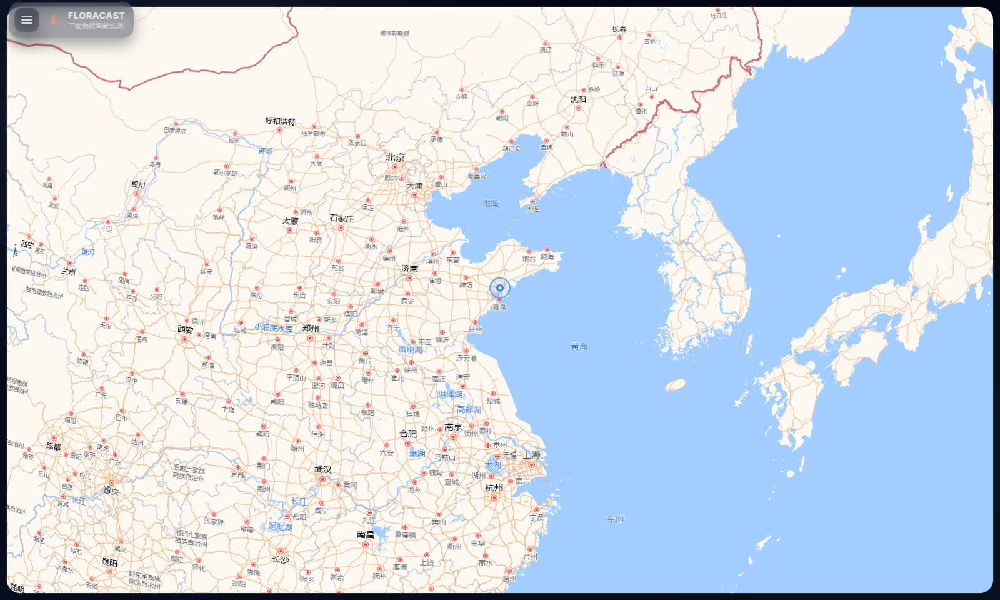  
*Figure 1: 3D Digital Twin Earth overview (Qingdao coastal study area with dynamic illumination, latitude-longitude grid, and high-precision vector basemap).*

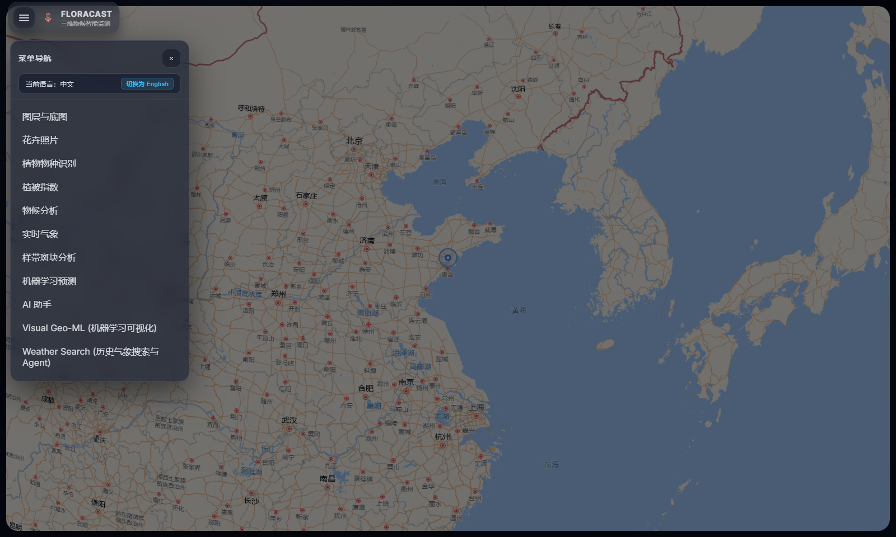  
*Figure 2: System navigation drawer providing access to Research Agent, Natural Language Weather Search, Spatial ML, and Remote Sensing Layer managers.*

---

### 3.2 Collaborative Research Agent Console

Researchers can propose open-ended hypotheses in plain language (e.g., investigating the delayed greenness response of coastal vegetation following severe drought). The agent parses spatial-temporal parameters and executes the coordinated analysis pipeline.

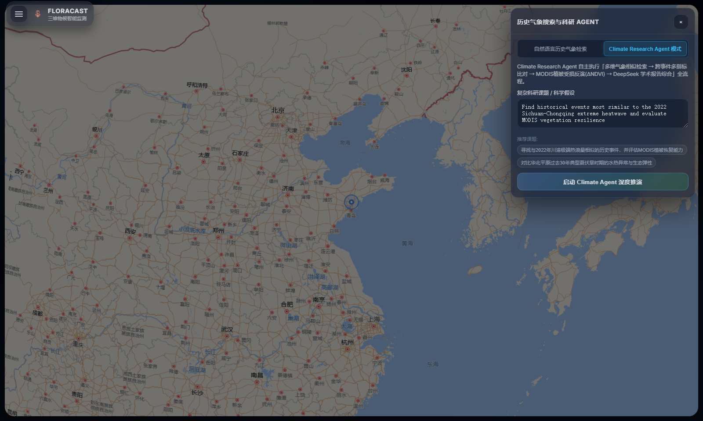  
*Figure 3: Interactive Research Agent console supporting custom scientific queries, center coordinates, radius, and historical baseline configurations.*

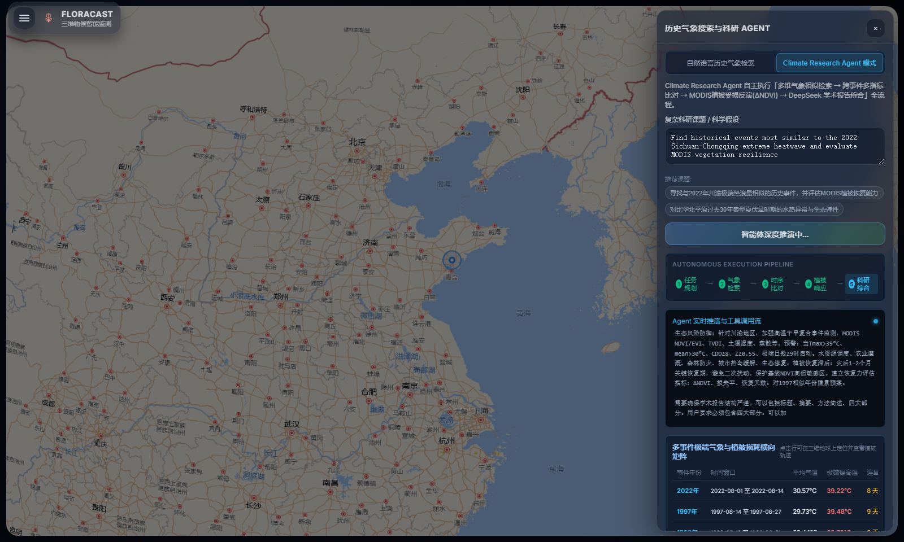  
*Figure 4: Eight-stage pipeline execution with synchronized streaming of the deep reasoning chain.*

---

### 3.3 Meteorological Semantic Search & Multi-Decadal Extreme Event Mining

Natural language weather search automatically translates descriptive statements into structured time-series queries across 40 years of daily meteorological data, discovering candidate heatwaves and drought periods.

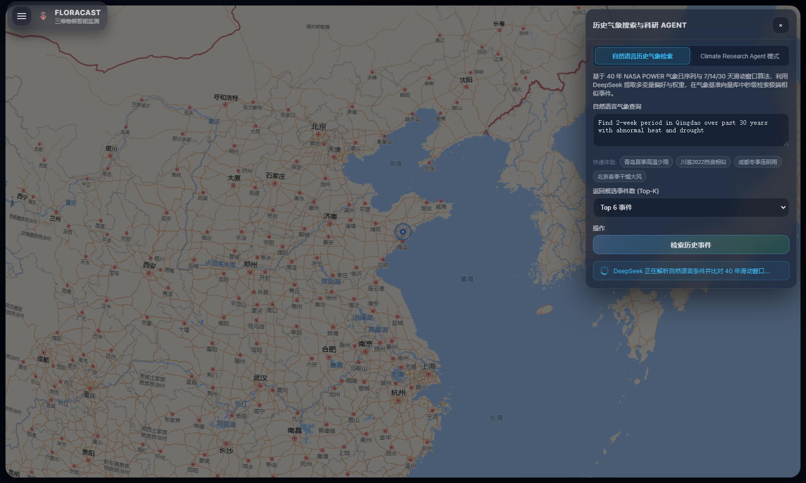  
*Figure 5: Meteorological semantic query panel highlighting candidate extreme weather windows and key multi-variable meteorological indicators.*

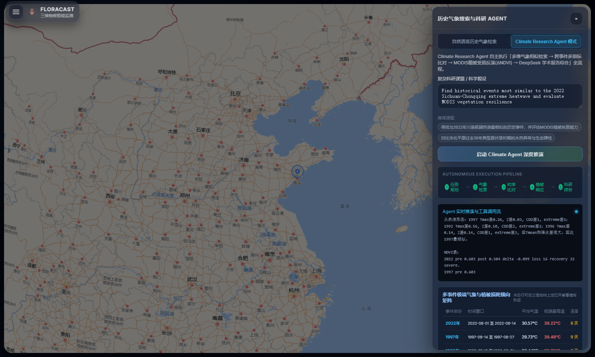  
*Figure 6: Quantitative comparison matrix benchmarking temperature Z-scores, precipitation anomalies, and consecutive dry days across candidate years.*

---

### 3.4 Deterministic Biophysical Modeling & Phenological Inversion

Using MODIS 250m surface reflectance (MOD09Q1) and NDVI/EVI timeseries, the system calculates vegetation green-up, peak growth, and senescence, evaluating drop magnitudes and recovery lag times under climate stress.

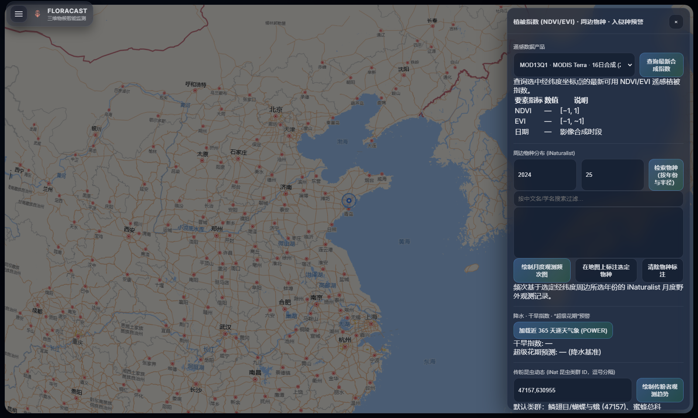  
*Figure 7: MODIS vegetation index inversion and ecological response curves illustrating greenness fluctuations and hydro-thermal drivers.*

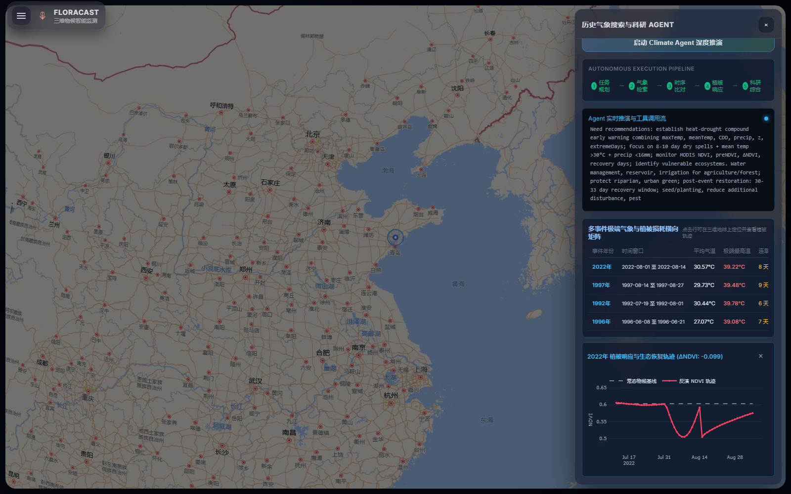  
*Figure 8: Ecological resilience recovery trajectory and executive summary demonstrating stress response and post-disturbance recovery latency.*

---

### 3.5 Client-Side Spatial Machine Learning (Visual Geo-ML)

The in-browser spatial machine learning module applies multivariate K-Means clustering, spatial autocorrelation, and inverse distance weighted (IDW) interpolation directly on client GPUs.

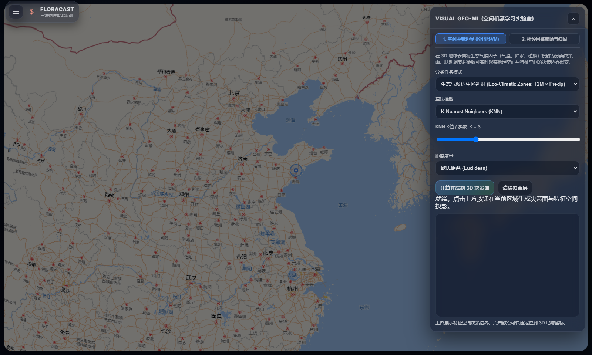  
*Figure 9: Visual Geo-ML interface presenting spatial clustering, feature correlation scatter plots, and neighborhood distribution metrics.*

---

### 3.6 Independent Research Protocol Workbench & Academic Synthesis

Designed for peer-reviewed research and cross-team reproduction, this standalone workbench freezes protocol parameters, verifies bibliographic citations, audits raw data streams, and exports publication-ready academic reports.

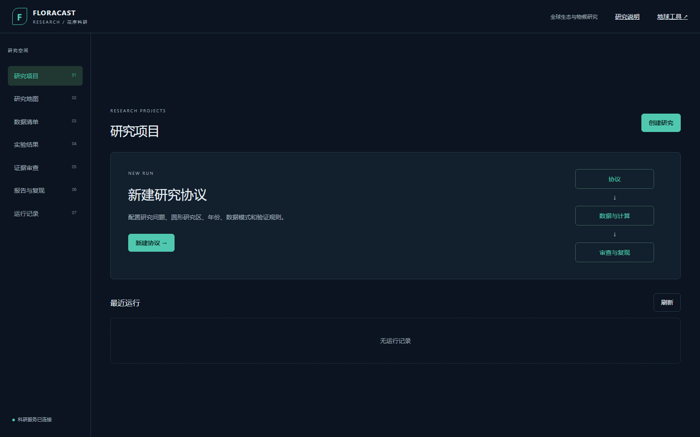  
*Figure 10: Protocol definition interface showing metadata freezing, citation references, and zero-hallucination data auditing.*

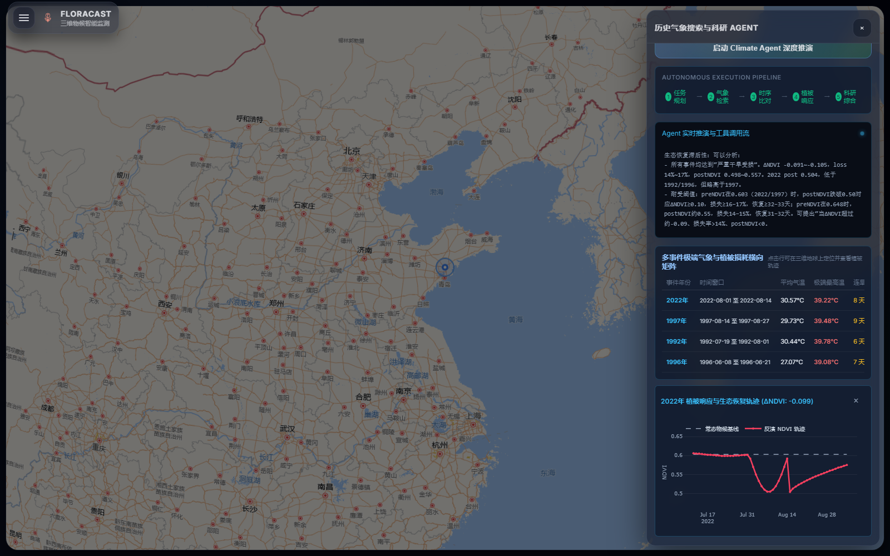  
*Figure 11: Structured academic research report including background, methodology, empirical comparisons, evidence reviews, and scientific limitations.*

---

## 4. Production Security Hardening Architecture

To safeguard API credentials and ensure high-availability service delivery, FloraCast deploys a multi-tier security gateway:

```
Client Request (Browser)
       │
       ▼ [Nginx Gateway Layer]
       ├── Referer Verification (Restricts access exclusively to authorized domains)
       ├── Rate Limiting (limit_req: 2 requests/sec, burst cap: 5)
       └── Strict CORS Policies
       │
       ▼ [Node.js Application Layer]
       ├── Secondary Domain Whitelist Enforcement
       ├── Zero Hardcoded Fallbacks (Loads strictly from secure environment variables)
       └── Automated Request Timeouts & Circuit Breakers
       │
       ▼ [AI & Biophysical Compute Backends]
       └── Official DeepSeek API / Local Biophysical Inversion Engines
```

- **Rate Limiting**: Configured with `limit_req_zone $binary_remote_addr zone=floracast_limit:10m rate=2r/s;` to block automated scraping and excessive calls.
- **Anti-Hotlinking (Referer Inspection)**: Enforces `valid_referers server_names *.openl.work;` to reject requests lacking proper origin headers.
- **Strict CORS**: Eliminates wildcard CORS permissions, ensuring queries originate only from designated domains.
- **Credential Hygiene**: Source code contains zero hardcoded API keys; all production secrets are injected through managed environment variables.

---

## 5. Technology Stack & System Components

| Layer | Technologies & Dependencies | Purpose & Responsibilities |
| :--- | :--- | :--- |
| **Presentation Layer** | CesiumJS (1.136.0) | High-performance 3D digital twin Earth interaction and satellite rendering |
| | Plotly.js (2.35.2) | Interactive scientific scatter plots, radar charts, and recovery curves |
| | TensorFlow.js | Client-side spatial clustering and linear trend regressions |
| | Marked.js | Markdown report rendering with KaTeX mathematical formulas |
| **Service Layer** | Node.js (v18+) & Express | API gateway, Server-Sent Events (SSE) streaming, and caching |
| | Axios & Multer | Data fetching pipelines and satellite tile streaming proxies |
| | openJiuwen Protocol Layer | Eight-stage research workflow orchestration and state management |
| **Scientific Models** | DeepSeek Official API (V3/R1) | Natural language intent parsing and synthesis of academic research reports |
| | Qwen-VL Vision API | Plant organ classification and species confidence identification |
| | Biophysical Inversion Engine | Thermal thresholds (GDD) and surface energy balance equations |
| **Gateway & Ops** | Nginx (1.24+) | SSL termination, rate limiting, and reverse proxy routing |
| | Systemd / Docker | Process daemon management and automated container recovery |

---

## 6. Quick Start & Local Deployment

### Prerequisites
- Node.js 18.0 or higher
- Git
- Modern browser supporting WebGL 2.0 (Google Chrome, Microsoft Edge, or Firefox)

### Installation

```bash
# Clone the repository
git clone https://github.com/Karl-XZ/FloraCast-Research.git
cd FloraCast-Research

# Install server dependencies
cd server
npm install
```

### Environment Setup

Create a `.env` file in the project root directory:

```ini
# DeepSeek API Configuration (Meteorological parsing and academic synthesis)
DEEPSEEK_API_KEY=your_deepseek_api_key
DEEPSEEK_API_BASE=https://api.deepseek.com
DEEPSEEK_MODEL=deepseek-chat

# Optional: Qwen-VL API (Plant multi-modal visual recognition)
QWEN_API_KEY=your_qwen_api_key
QWEN_API_BASE=https://dashscope.aliyuncs.com/compatible-mode/v1
QWEN_TEXT_MODEL=qwen-plus
QWEN_VISION_MODEL=qwen-vl-plus

# Server Port
PORT=5174
```

### Run Application

```bash
# From within the server directory
npm start
```

Access in your browser:
- 3D Digital Twin Earth: `http://localhost:5174/`
- Independent Research Workbench: `http://localhost:5174/research.html`

---

## 7. Environment Configuration Guidelines

1. **Zero Credential Hardcoding**: Server-side modules strictly read from `process.env.*` and raise explicit exceptions when keys are missing.
2. **Git Repository Hygiene**: All `.env` files and local caches are protected by `.gitignore` to prevent accidental commits.
3. **Usage Monitoring**: Configure daily quota ceilings and balance alerts in your AI provider dashboard to avoid unexpected usage spikes.

---

## 8. Data Sources & Open Licenses

- **Satellite Remote Sensing**: NASA GIBS, MODIS Terra/Aqua surface reflectance observations.
- **Meteorological Reanalysis**: NASA POWER Global Agroclimatology Daily Dataset (1985–2024).
- **Marine & Atmospheric Forecast Tiles**: [OpenPortGuide](https://weather.openportguide.de/) (Licensed under [CC BY-NC-SA 4.0](https://creativecommons.org/licenses/by-nc-sa/4.0/)).
- **Basemap Layers**: Gaode Vector Maps, Baidu Satellite Imagery.
- **Open Source License**: FloraCast is released under the [MIT License](LICENSE) for open academic research, ecological monitoring, and educational exploration.
